# $${\color{blue}G} - {\color{red}E}{\color{yellow}a}{\color{lightgreen}s}{\color{lightblue}y}$$ Calendar

## **Index**

1. [Description](https://github.com/I-M-Marinov/Calendar-by-I-M-Marinov?tab=readme-ov-file#---description)
2. [Technology Stack](https://github.com/I-M-Marinov/Calendar-by-I-M-Marinov?tab=readme-ov-file#--technology-stack)
3. [Features](https://github.com/I-M-Marinov/Calendar-by-I-M-Marinov?tab=readme-ov-file#-features)
   - [Dashboard](https://github.com/I-M-Marinov/Calendar-by-I-M-Marinov?tab=readme-ov-file#large_blue_diamond-dashboard)
   - [Calendars --> Calendar List](https://github.com/I-M-Marinov/Calendar-by-I-M-Marinov?tab=readme-ov-file#large_blue_diamond-calendars----calendar-list)
     - [Remove](https://github.com/I-M-Marinov/Calendar-by-I-M-Marinov?tab=readme-ov-file#%EF%B8%8F-remove-----delete-a-secondary-calendar)
     - [Edit](https://github.com/I-M-Marinov/Calendar-by-I-M-Marinov?tab=readme-ov-file#%EF%B8%8F-edit-----edit-a-secondary-calendars-title-andor-description)
   - [Calendars --> Create a Calendar](https://github.com/I-M-Marinov/Calendar-by-I-M-Marinov?tab=readme-ov-file#large_blue_diamond-calendars----create-a-calendar)
   - [Events --> Events per Calendar](https://github.com/I-M-Marinov/Calendar-by-I-M-Marinov?tab=readme-ov-file#large_blue_diamond-events----events-per-calendar)
     - [Copy To](https://github.com/I-M-Marinov/Calendar-by-I-M-Marinov/tree/master#%EF%B8%8F-copy-to-----copy-to-function-is-available-for-all-events-but-destination-calendars--where-the-event-will-be-copied-to--can-only-be-ones-with-access-role-owner-or-writer-this-function-creates-a-copy-of-the-event-the-user-designated-to-one-of-the-calendars-from-the-drop-down-menu-after-it-is-created-the-user-can-navigate-easily-to-the-destination-calendar-to-see-the-newly-copied-event)
     - [Edit](https://github.com/I-M-Marinov/Calendar-by-I-M-Marinov?tab=readme-ov-file#%EF%B8%8F-edit-----edit-an-event-and-save-it-back-to-your-google-calendar)
     - [Delete](https://github.com/I-M-Marinov/Calendar-by-I-M-Marinov?tab=readme-ov-file#%EF%B8%8F-delete-----delete-an-event-from-your-google-calendar)
     - [Duplicate Event](https://github.com/I-M-Marinov/Calendar-by-I-M-Marinov?tab=readme-ov-file#%EF%B8%8F-duplicate-----creates-a-duplicate-of-the-event-saved-in-the-primary-calendar-of-the-user-adds-duplicate-to-the-name)
   - [Events --> Add an Event](https://github.com/I-M-Marinov/Calendar-by-I-M-Marinov?tab=readme-ov-file#large_blue_diamond-events----add-an-event)
   - [Events --> Search Events](https://github.com/I-M-Marinov/Calendar-by-I-M-Marinov?tab=readme-ov-file#large_blue_diamond-events----search-events)
   - [Contacts --> Show Contacts](https://github.com/I-M-Marinov/Calendar-by-I-M-Marinov/blob/master/README.md#large_orange_diamond-contacts----show-contacts)
   - [Contacts --> Add a contact](https://github.com/I-M-Marinov/Calendar-by-I-M-Marinov/blob/master/README.md#large_orange_diamond-contacts----add-a-contact)
4. [Screenshots](https://github.com/I-M-Marinov/Calendar-by-I-M-Marinov?tab=readme-ov-file#-screenshots)
5. [If You Would Like to Try This Web App Yourself](https://github.com/I-M-Marinov/Calendar-by-I-M-Marinov?tab=readme-ov-file#-if-you-would-like-to-try-this-web-app-yourself)

<h2 align="center">
   Description:
</h2>

- Web application that works with Google API and helps the user control their Google Calendar

<h2 align="center">
  Technology stack:
</h2>

- C#
- .NET Core
- ASP.NET MVC
- JavaScript
- HTML & CSS
- Google Calendar API (https://developers.google.com/calendar/api/guides/overview)
- Google People API (https://developers.google.com/people)

<h2 align="center">
 Features:
</h2>

#### :large_blue_diamond: Dashboard 
- Shows the user the events for the current date

#### :large_blue_diamond: Calendars --> Calendar List 
- Shows the user all the calendars showing in his/her Google Calendar (Family, Phases of the Moon or any imported calendar).
- See the name of the calendar (user's primary calendar marked with a star and the word "primary"), the events count for each calendar and actions available. Primary calendar cannot be Edited or Removed, but secondary calendars that have the Access Role of "owner" can. Access role is visualized when the user is hovering over the name of each calendar ( it shows the calendar description if any and then the access role for that calendar ). 
    ###### ➡️ Remove ---> Delete a secondary calendar.
    ###### ➡️ Edit ---> Edit a secondary calendar's title and/or description.
###### 📢: The events shown would be until the end of the calendar year, starting from the beginning of the current day.

#### :large_blue_diamond: Calendars --> Create a Calendar
- Adds a new (secondary) calendar to the user's Google Calendar.
- New calendars added with this functions are all with Access Role: "owner".
  ###### 📢: Every calendar except the primary one is a secondary calendar, but with different Access Role and Options as per Google.
#### :large_blue_diamond: Events --> Events per calendar
- User can choose from the dropdown menu a calendar and use the "Load Events" button to visualize all events for that calendar.
- "All calendars" option visualizes all the events in all calendars, order by calendar and then by time of occurance.
- Additional functions "Edit" and "Delete" avaialble for all events that are from calendars that the user has Access Role "owner" or "writer".
  ###### ➡️ Copy to ---> Copy to function is available for all events, but destination calendars ( where the event will be copied to ) can only be ones with access role "owner" or "writer". This function creates a copy of the event the user designated to one of the calendars from the drop down menu. After it is created the user can navigate easily to the destination calendar to see the newly copied event.
  ###### ➡️ Edit ---> Edit an event and save it back to your google calendar.
  ###### ➡️ Delete ---> Delete an event from your Google calendar.
- Function "Duplicate Event" available for all events (except all day events), regardless of Access Role for the respective calendar.
  ###### ➡️ Duplicate ---> Creates a duplicate of the event, saved in the primary calendar of the user. Adds "duplicate" to the name.

#### :large_blue_diamond: Events --> Add an Event
- Add an Event adds a new Event to the primary calendar of the user.
  ###### 📢:  User can add a title, location and a description for their new event. It can be saved as public or a private event (visibility).  Event type can be single, annual or all day event. 
  ###### 📢:  New Events can now add atendees to the event using the email input field available. If more than one attendee needs to be added, user uses the "Add" button to add a field ( and use "Remove" button to remove any fields that are not needed )
  ###### 📢:  Added a back button that would take the user back to the Calendars List 
#### :large_blue_diamond: Events --> Search Events
- Search Events lets the user search through all events that editable ( Access Role in the calendar the event is saved in must be "owner" ) and edit them all at the same time.
  ###### 📢:  Search Events actually opens for edit all events that match the search keyword ( case-insensitive ). 
#### :large_orange_diamond: Contacts --> Show Contacts
- Show all contacts from the user's Google Contacts List.
###### 📢:  User can choose label/group to visualize all the contacts only in that group or search through the contact list using the letter cards on top ( Latin and Cyrilic script ) to find a name. 
#### :large_orange_diamond: Contacts --> Add a contact
- Adds a contact to the user's Google Contacts List.
###### 📢:  As of now the user can add the First name, Last name, Email, Phone Number, Birthday and add the new contact in a group at the time of creation. 
<h2 align="center">
 Screenshots:
</h2>

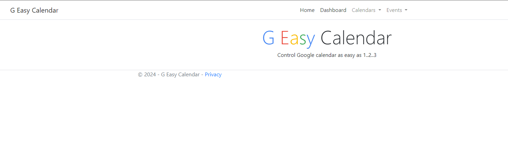

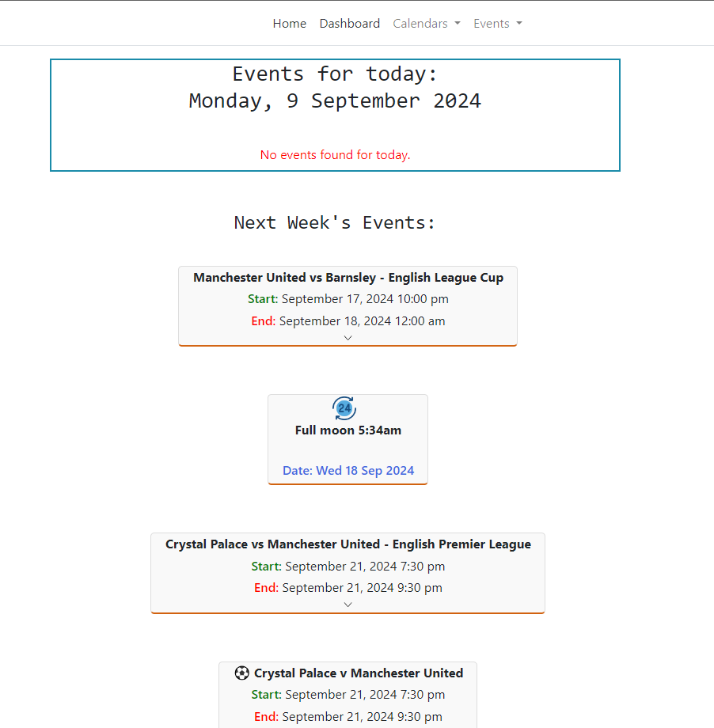

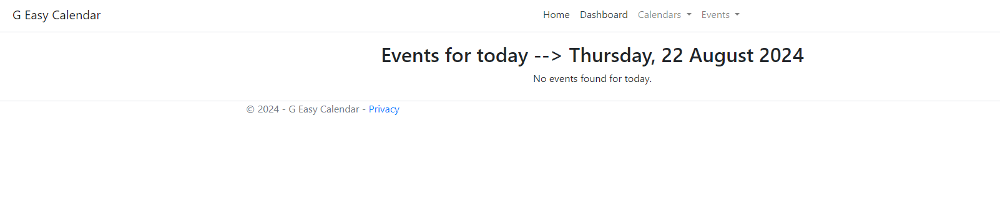

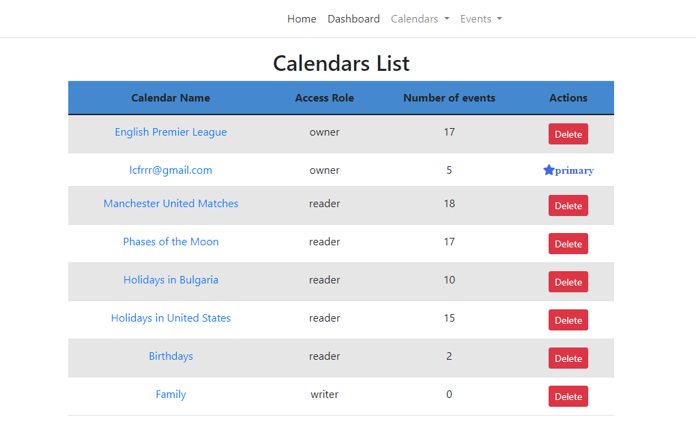

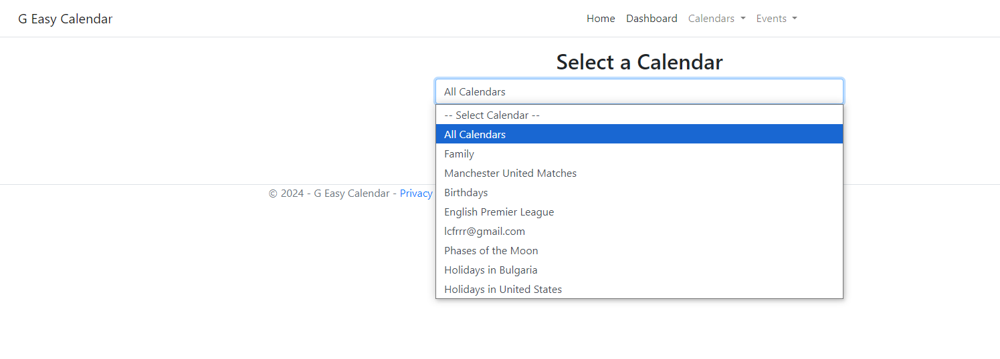

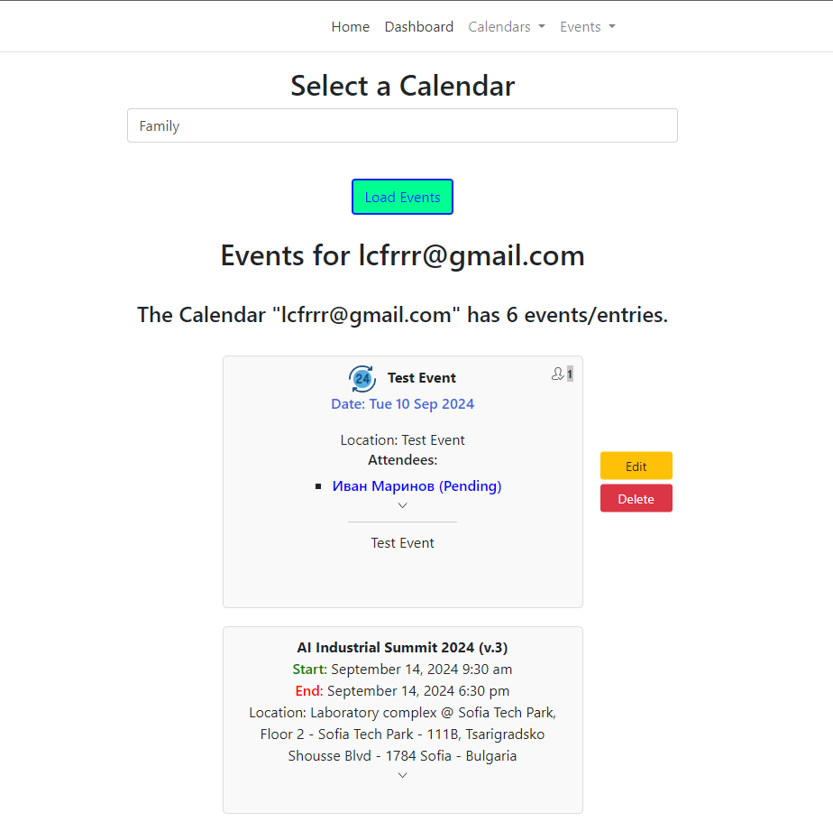

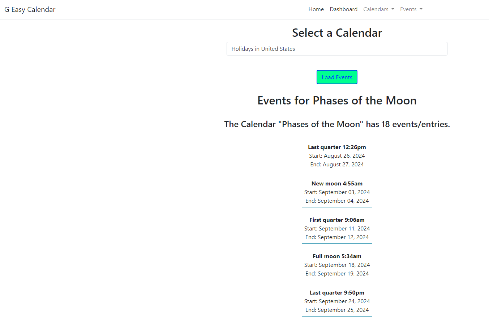

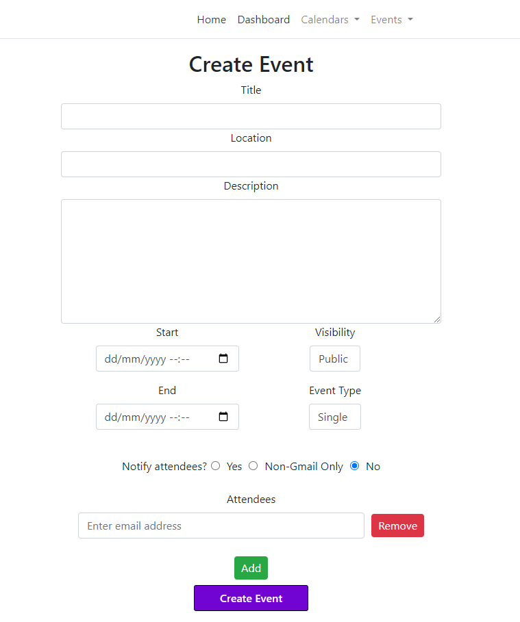

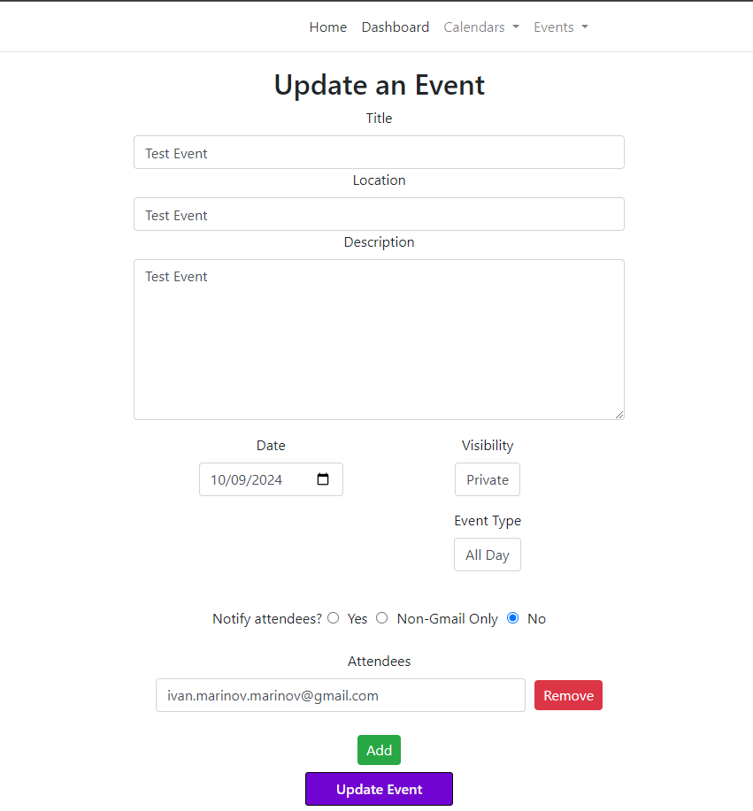

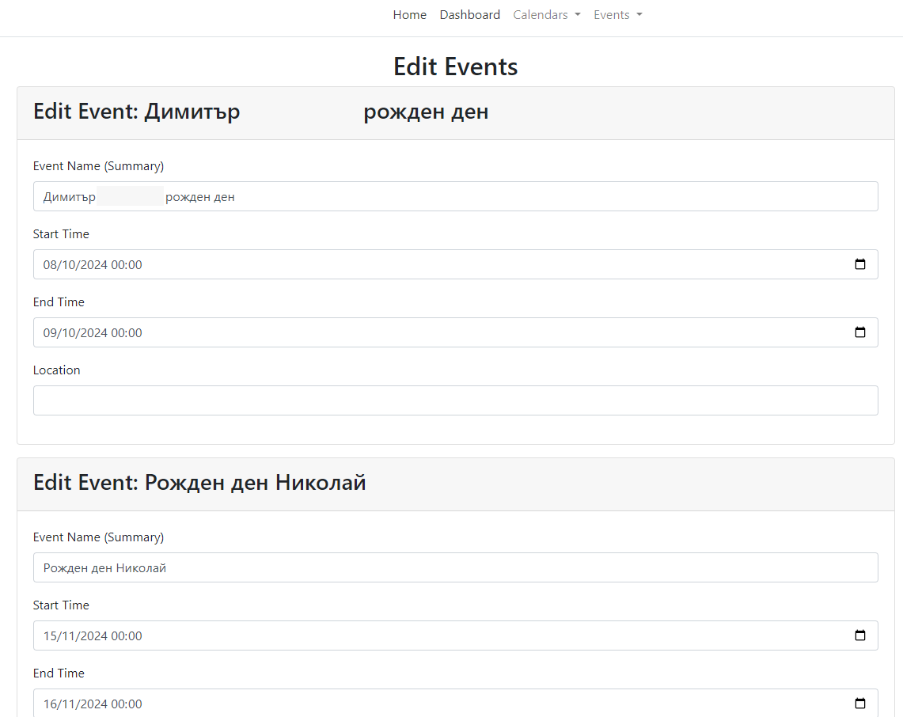

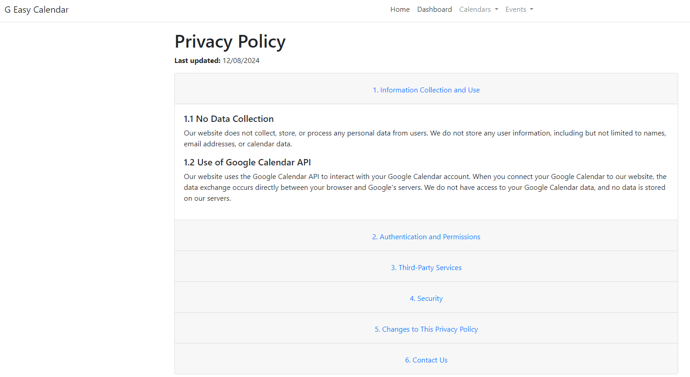

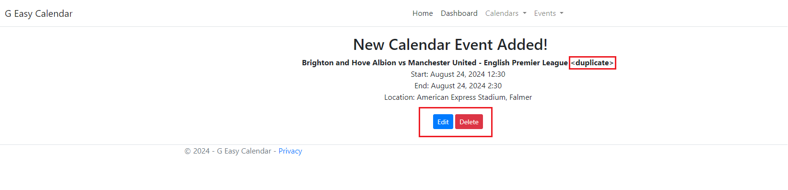

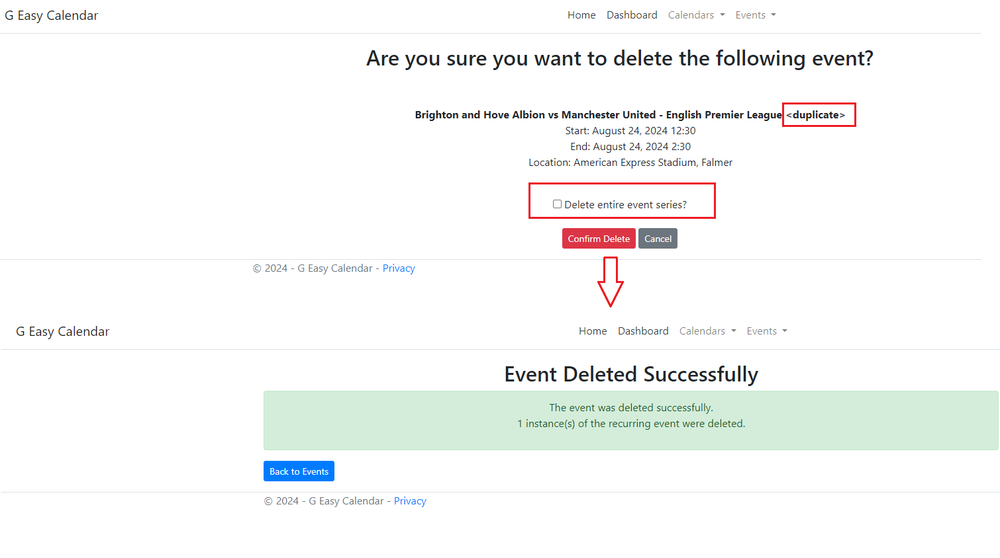

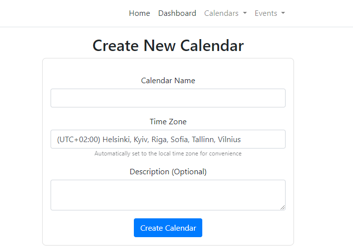

<h2 align="center">
 If you would like to try this Web App yourself:
</h2>

- 🍴: Fork  the repo ! :) 
- Go to https://console.cloud.google.com/, login with the google account you want to use and create a new web application, then activate the Google Calendar API and the Google People API for that application.
###### 📢: Below is the explanation on how to setup the Google Calendar API, but process is pretty much the same for the People API as well. ( If you set them up separetly you would need to give permission from your account to both APIs for the App to function of course )
- Once enabled navigate to the Credentials tab.
- You would need to set the Authorized redirect URIs as well. Since you will be running the web server locally add either http://127.0.0.1/authorize/ or http://localhost/authorize/ ( or both to be sure ).
- Get the Client Id and Client Secret. If you are planning on keeping this web app's repo open source on your account it would be great idea not to commit any sensitive data:
  - You can use Git Bash ( or any other terminal where .NET Core command-line interface is available ) to add your Client Id and Client Secret to the .NET User Secrets:
  
                    $ dotnet user-secrets set "Google:ClientSecret" "YOUR_GOOGLE_CLIENT_SECRET"
  
                    $ dotnet user-secrets set "Google:ClientId" "YOUR_GOOGLE_CLIENT_ID"

                        ** note that those commands are to be executed once you navigate to the the root of the project **
  
- ⚠️ You can of course also add the client_secret.json ( downloaded from the Credentials tab ) and put that somewhere in your project, but add it to the .gitignore file before your next commit ! Personally I prefer  .NET User Secrets Manager.

- Going to the app and the Services folder, Open the GoogleCalendarService and ensure the clientId and clientSecret are present in the constructor:

                         public GoogleCalendarService(IConfiguration configuration)
                  {
                  	var clientId = configuration["Google:ClientId"];
                  	var clientSecret = configuration["Google:ClientSecret"];
                  
                  	var clientSecrets = new ClientSecrets
                  	{
                  		ClientId = clientId,
                  		ClientSecret = clientSecret
                  	};
                  
                  	UserCredential credential = GoogleWebAuthorizationBroker.AuthorizeAsync(
                  		clientSecrets,
                  		new[] { CalendarService.Scope.Calendar }, 
                  		"user",
                  		CancellationToken.None,
                  		new FileDataStore("token.json", true)).Result;
                  
                  	_service = new CalendarService(new BaseClientService.Initializer()
                  	{
                  		HttpClientInitializer = credential,
                  		ApplicationName = _applicationName,
                  	});
                  }

 - Authorizing and giving permission to the app to work on your calendar would generate token.json folder, that would contain a file that has your access_token and refresh_token.
         ⚠️ Please add the whole folder to the .gitignore file, so it is not uploaded on the next commit.
 - First time you start the project without debugging should start the web server ( locally ) and redirect your to the authorization screen. If you would like to add an option for an extra user to access the app you can navigate to the OAuth Consent Screen tab in the APIs and Services on the Google Developer Console and add Test Users via email. ( To login with another user you would have to delete the "token.json" folder manually ).
   
   ⚠️ ⚠️ ⚠️ Please not that once you set up the .NET User Secrets, they should be working just fine with the Google People API as well, but do not forget to add to the .gitignore the newly created folder "people_token.json", so you do not include your access and refresh tokens on Github ( especially if the repo is PUBLIC !!!! ); 

     
