# $${\color{blue}G} - {\color{red}E}{\color{yellow}a}{\color{lightgreen}s}{\color{lightblue}y}$$ Calendar

## Description:

- Web application that works with Google API and helps the user control their Google Calendar

## Technology stack:

- C#
- .NET Core
- ASP.NET MVC
- JavaScript
- HTML & CSS
- Google Calendar API (https://developers.google.com/calendar/api/guides/overview)

## Features
#### :large_blue_diamond: Dashboard 
- Shows the user the events for the current date

#### :large_blue_diamond: Calendars --> Calendar List 
- Shows the user all the calendars showing in his/her Google Calendar (Family, Phases of the Moon or any imported calendar).
- See the name of the calendar (user's primary calendar would be visualized as user's gmail address), the access role that the user have for each calendar and the events added for each one.
###### 📢: The events shown would be until the end of the calendar year, starting from the beginning of the current day.

#### :large_blue_diamond: Events --> Events per calendar
- User can choose from the dropdown menu a calendar and use the "Load Events" button to visualize all events for that calendar.
- "All calendars" option visualizes all the events in all calendars, order by calendar and then by time of occurance.
- Additional functions "Edit" and "Delete" avaialble for all events that are from calendars that the user has Access Role "owner" or "writer".
  ###### ➡️ Edit ---> Edit an event and save it back to your google calendar.
  ###### ➡️ Delete ---> Delete an event from your Google calendar.
- Function "Duplicate Event" available for all events (except all day events), regardless of Access Role for the respective calendar.
  ###### ➡️ Duplicate ---> Creates a duplicate of the event, saved in the primary calendar of the user. Adds "duplicate" to the name.

#### :large_blue_diamond: Events --> Add an Event
- Add an Event adds a new Event to the primary calendar of the user.
  ###### 📢:  User can add a title, location and a description for their new event. It can be saved as public or a private event (visibility).  Event type can be single, annual or all day event. 

#### :large_blue_diamond: Events --> Search Events
- Search Events lets the user search through all events that editable ( Access Role in the calendar the event is saved in must be "owner" ) and edit them all at the same time.
  ###### 📢:  Search Events actually opens for edit all events that match the search keyword ( case-insensitive ). 

## Screenshots

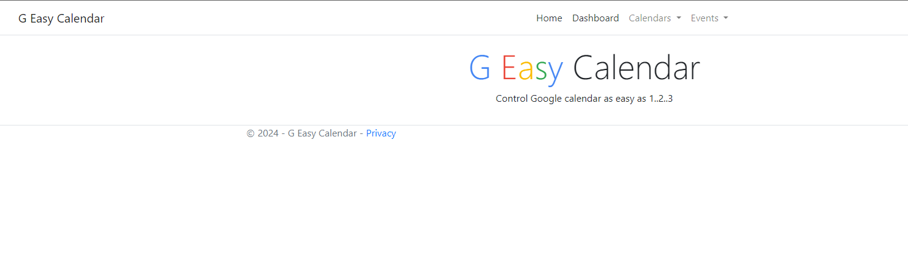

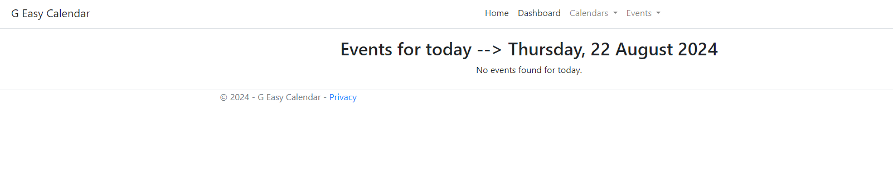

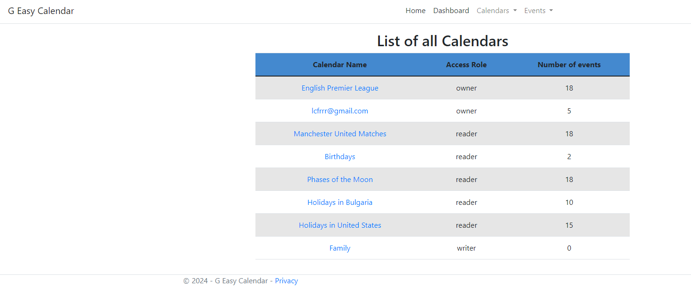

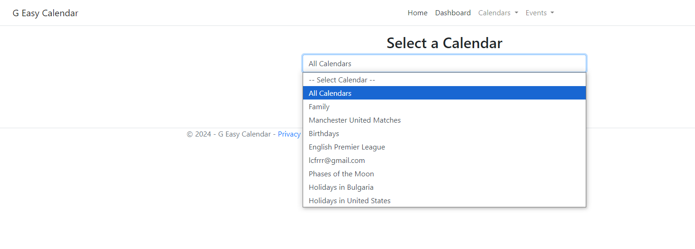

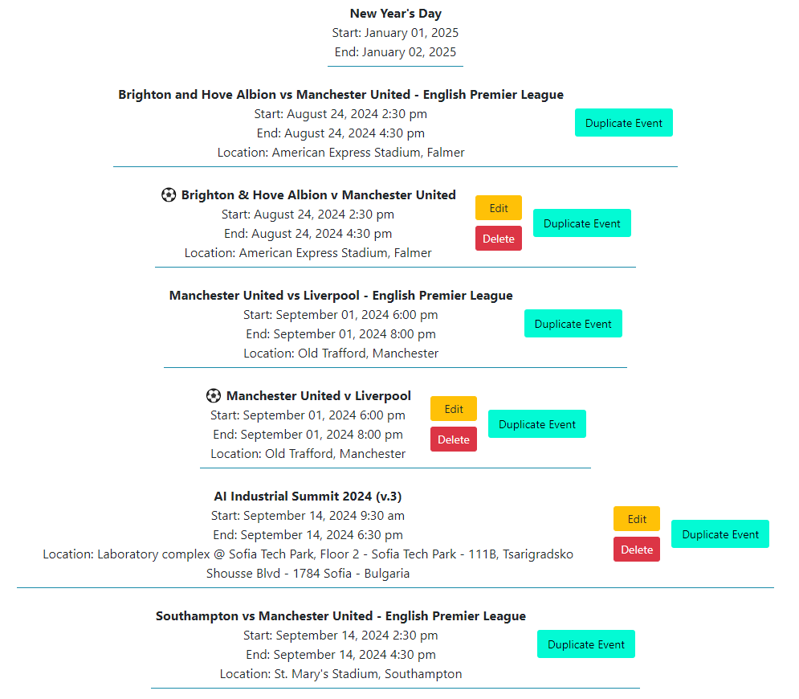

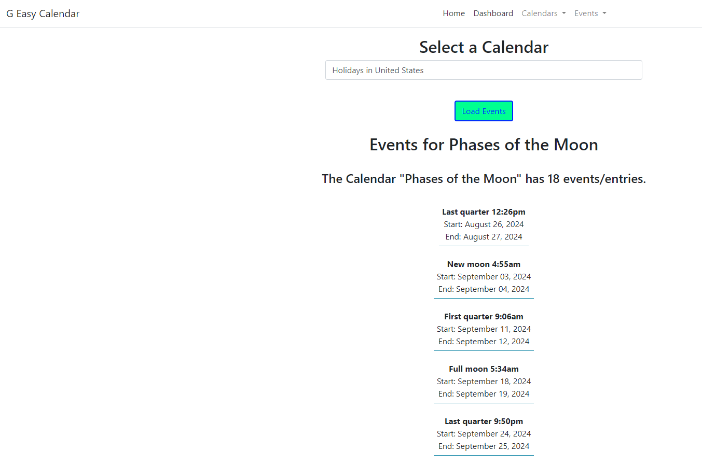

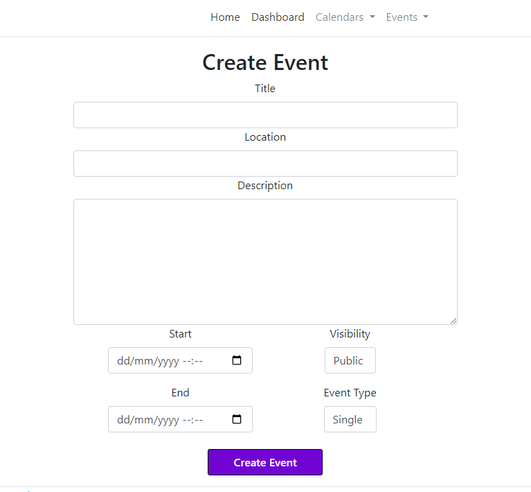

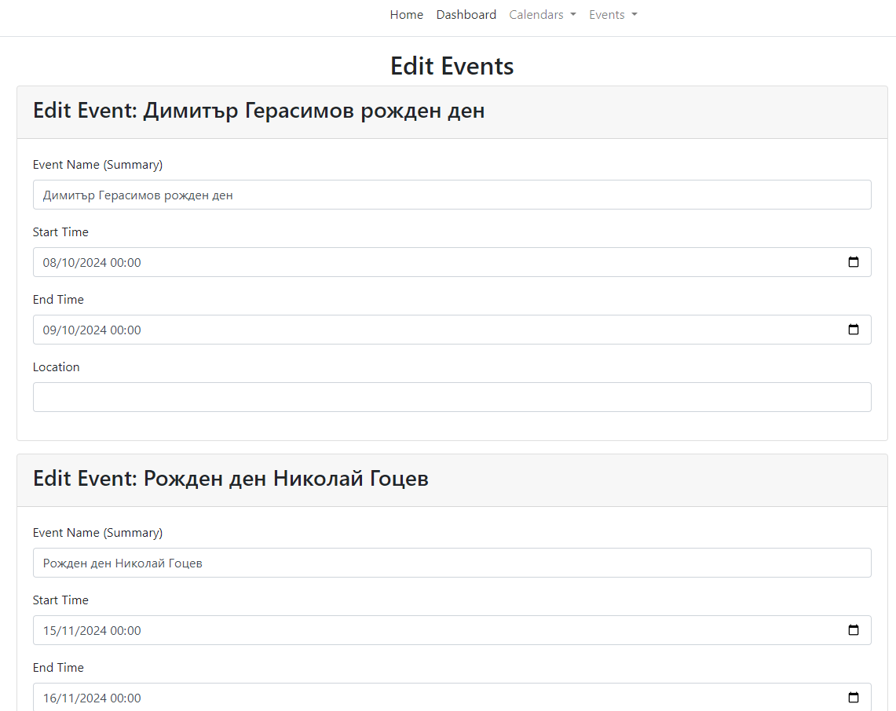

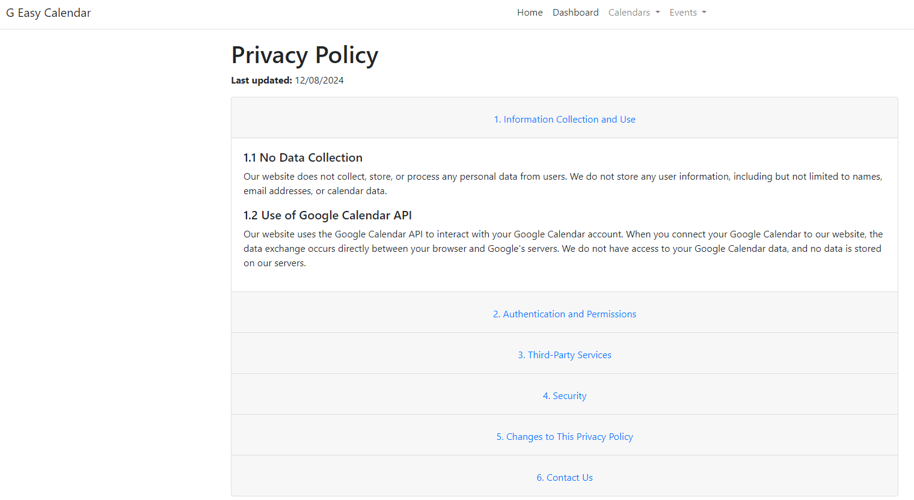

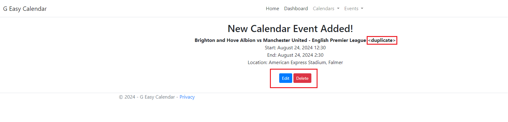

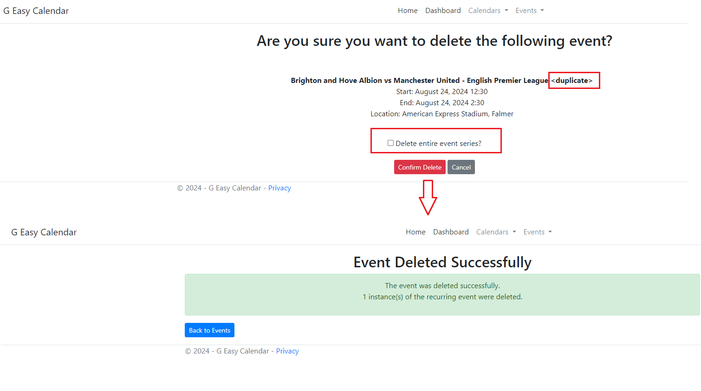

