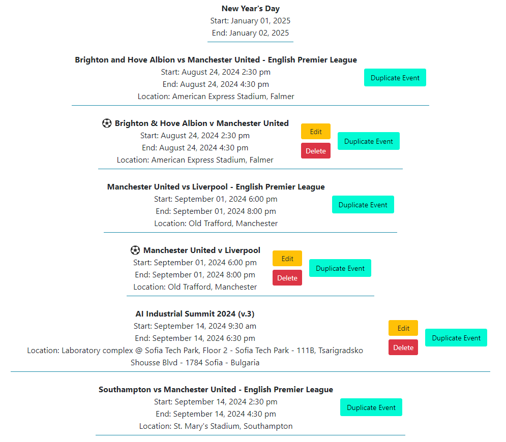

# $${\color{blue}G} - {\color{red}E}{\color{yellow}a}{\color{lightgreen}s}{\color{lightblue}y}$$ Calendar

## **Index**

1. [Description](https://github.com/I-M-Marinov/Calendar-by-I-M-Marinov/blob/master/README.md#description)
2. [Technology Stack](https://github.com/I-M-Marinov/Calendar-by-I-M-Marinov/blob/master/README.md#technology-stack)
3. [Features](https://github.com/I-M-Marinov/Calendar-by-I-M-Marinov?tab=readme-ov-file#features)
   - [Dashboard](https://github.com/I-M-Marinov/Calendar-by-I-M-Marinov/blob/master/README.md#large_blue_diamond-dashboard)
   - [Calendars --> Calendar List](https://github.com/I-M-Marinov/Calendar-by-I-M-Marinov/blob/master/README.md#large_blue_diamond-calendars----calendar-list)
   - [Events --> Events per Calendar](https://github.com/I-M-Marinov/Calendar-by-I-M-Marinov/blob/master/README.md#large_blue_diamond-events----events-per-calendar)
     - [Edit](https://github.com/I-M-Marinov/Calendar-by-I-M-Marinov/blob/master/README.md#%EF%B8%8F-edit-----edit-an-event-and-save-it-back-to-your-google-calendar)
     - [Delete](https://github.com/I-M-Marinov/Calendar-by-I-M-Marinov/blob/master/README.md#%EF%B8%8F-delete-----delete-an-event-from-your-google-calendar)
     - [Duplicate Event](https://github.com/I-M-Marinov/Calendar-by-I-M-Marinov/blob/master/README.md#%EF%B8%8F-duplicate-----creates-a-duplicate-of-the-event-saved-in-the-primary-calendar-of-the-user-adds-duplicate-to-the-name)
   - [Events --> Add an Event](https://github.com/I-M-Marinov/Calendar-by-I-M-Marinov/blob/master/README.md#large_blue_diamond-events----add-an-event)
   - [Events --> Search Events](https://github.com/I-M-Marinov/Calendar-by-I-M-Marinov/blob/master/README.md#large_blue_diamond-events----search-events)
4. [Screenshots](https://github.com/I-M-Marinov/Calendar-by-I-M-Marinov?tab=readme-ov-file#screenshots)
5. [If You Would Like to Try This Web App Yourself](https://github.com/I-M-Marinov/Calendar-by-I-M-Marinov/blob/master/README.md#if-you-would-like-to-try-this-web-app-yourself)

## 
Description:

- Web application that works with Google API and helps the user control their Google Calendar

## Technology stack:

- C#
- .NET Core
- ASP.NET MVC
- JavaScript
- HTML & CSS
- Google Calendar API (https://developers.google.com/calendar/api/guides/overview)

## Features
#### :large_blue_diamond: Dashboard 
- Shows the user the events for the current date

#### :large_blue_diamond: Calendars --> Calendar List 
- Shows the user all the calendars showing in his/her Google Calendar (Family, Phases of the Moon or any imported calendar).
- See the name of the calendar (user's primary calendar would be visualized as user's gmail address), the access role that the user have for each calendar and the events added for each one.
###### 📢: The events shown would be until the end of the calendar year, starting from the beginning of the current day.

#### :large_blue_diamond: Events --> Events per calendar
- User can choose from the dropdown menu a calendar and use the "Load Events" button to visualize all events for that calendar.
- "All calendars" option visualizes all the events in all calendars, order by calendar and then by time of occurance.
- Additional functions "Edit" and "Delete" avaialble for all events that are from calendars that the user has Access Role "owner" or "writer".
  ###### ➡️ Edit ---> Edit an event and save it back to your google calendar.
  ###### ➡️ Delete ---> Delete an event from your Google calendar.
- Function "Duplicate Event" available for all events (except all day events), regardless of Access Role for the respective calendar.
  ###### ➡️ Duplicate ---> Creates a duplicate of the event, saved in the primary calendar of the user. Adds "duplicate" to the name.

#### :large_blue_diamond: Events --> Add an Event
- Add an Event adds a new Event to the primary calendar of the user.
  ###### 📢:  User can add a title, location and a description for their new event. It can be saved as public or a private event (visibility).  Event type can be single, annual or all day event. 

#### :large_blue_diamond: Events --> Search Events
- Search Events lets the user search through all events that editable ( Access Role in the calendar the event is saved in must be "owner" ) and edit them all at the same time.
  ###### 📢:  Search Events actually opens for edit all events that match the search keyword ( case-insensitive ). 

## Screenshots

## If you would like to try this Web App yourself:

- 🍴: Fork  the repo ! :) 
- Go to https://console.cloud.google.com/, login with the google account you want to use and create a new web application, then activate the Google Calendar API for that application.
- Once enabled navigate to the Credentials tab.
- You would need to set the Authorized redirect URIs as well. Since you will be running the web server locally add either http://127.0.0.1/authorize/ or http://localhost/authorize/ ( or both to be sure ).
- Get the Client Id and Client Secret. If you are planning on keeping this web app's repo open source on your account it would be great idea not to commit any sensitive data:
  - You can use Git Bash ( or any other terminal where .NET Core command-line interface is available ) to add your Client Id and Client Secret to the .NET User Secrets:
  
                    $ dotnet user-secrets set "Google:ClientSecret" "YOUR_GOOGLE_CLIENT_SECRET"
  
                    $ dotnet user-secrets set "Google:ClientId" "YOUR_GOOGLE_CLIENT_ID"

                        ** note that those commands are to be executed once you navigate to the the root of the project **
  
- ⚠️ You can of course also add the client_secret.json ( downloaded from the Credentials tab ) and put that somewhere in your project, but add it to the .gitignore file before your next commit ! Personally I prefer  .NET User Secrets Manager.

- Going to the app and the Services folder, Open the GoogleCalendarService and ensure the clientId and clientSecret are present in the constructor:

                         public GoogleCalendarService(IConfiguration configuration)
                  {
                  	var clientId = configuration["Google:ClientId"];
                  	var clientSecret = configuration["Google:ClientSecret"];
                  
                  	var clientSecrets = new ClientSecrets
                  	{
                  		ClientId = clientId,
                  		ClientSecret = clientSecret
                  	};
                  
                  	UserCredential credential = GoogleWebAuthorizationBroker.AuthorizeAsync(
                  		clientSecrets,
                  		new[] { CalendarService.Scope.Calendar }, 
                  		"user",
                  		CancellationToken.None,
                  		new FileDataStore("token.json", true)).Result;
                  
                  	_service = new CalendarService(new BaseClientService.Initializer()
                  	{
                  		HttpClientInitializer = credential,
                  		ApplicationName = _applicationName,
                  	});
                  }

 - Authorizing and giving permission to the app to work on your calendar would generate token.json folder, that would contain a file that has your access_token and refresh_token.
         ⚠️ Please add the whole folder to the .gitignore file, so it is not uploaded on the next commit.
 - First time you start the project without debugging should start the web server ( locally ) and redirect your to the authorization screen. If you would like to add an option for an extra user to access the app you can navigate to the OAuth Consent Screen tab in the APIs and Services on the Google Developer Console and add Test Users via email. ( To login with another user you would have to delete the "token.json" folder manually ).

     
